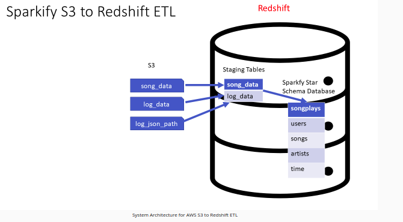
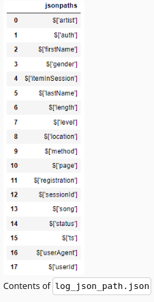
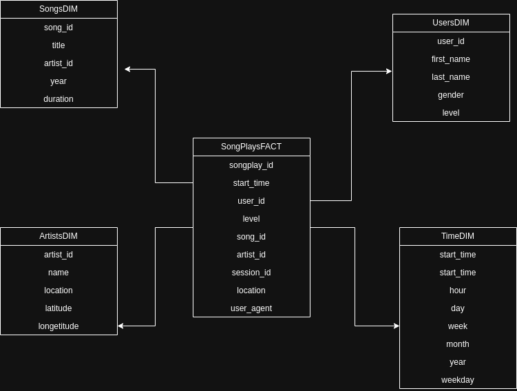

# The Sparkfy 
Sparkify is a music streming startup with many daily listeners. Sparkfy's databases grew over time and the need arose to move this data to a cloud environment.
So the goal of this project is to move their process and data to this new enviroment.

# AWS  Cloud
To build this architecture will be used the AWS cloud. The services used will be:
- IAM
- Redshift
- EC2
- S3

# Sparkfy  S3 to Redshift ETL
The main task of this project is build a ETL pepiline that extracts  their data from S3, stages them in Redshift, and transforms data into a set of dimensional tables for their analytics team to continue finding insights into what songs their users are listening to.
The following image show the system architecture for AWS S3 to Redshift ETL:




# Datasets
Their data resides in S3, in a directory of JSON logs on user activity on the app, as well as a directory with JSON metadata on the songs in their app.
There are two datasets :

- Song data: s3://udacity-dend/song_data
- Log data: s3://udacity-dend/log_data

To properly read log data s3://udacity-dend/log_data, it is need following metadata file:
Log metadata: s3://udacity-dend/log_json_path.json

## Song Dataset
The first dataset is a subset of real data from the Million Song Dataset(opens in a new tab). Each file is in JSON format and contains metadata about a song and the artist of that song. The files are partitioned by the first three letters of each song's track ID. For example, here are file paths to two files in this dataset.

```sh
            song_data/A/B/C/TRABCEI128F424C983.json
            song_data/A/A/B/TRAABJL12903CDCF1A.json
```
And below is an example of what a single song file, TRAABJL12903CDCF1A.json, looks like.
```sh
{
"num_songs": 1,
"artist_id": "ARJIE2Y1187B994AB7",
"artist_latitude": null, 
"artist_longitude": null,
"artist_location": "", 
"artist_name": "Line Renaud", 
"song_id": "SOUPIRU12A6D4FA1E1", 
"title": "Der Kleine Dompfaff",
"duration": 152.92036, 
"year": 0
}    
```

## Log Dataset
The second dataset consists of log files in JSON format generated by this event simulator(opens in a new tab) based on the songs in the dataset above. These simulate app activity logs from an imaginary music streaming app based on configuration settings.

The log files in the dataset you'll be working with are partitioned by year and month. For example, here are file paths to two files in this dataset.
```sh
        log_data/2018/11/2018-11-12-events.json
        log_data/2018/11/2018-11-13-events.json
```
And below is an example of what the data in a log file, 2018-11-12-events.json, looks like:


## Log JSON Metadata
The log_json_path.json file is used when loading JSON data into Redshift. It specifies the structure of the JSON data so that Redshift can properly parse and load it into the staging tables.

In the context of this project, you will need the log_json_path.json file in the COPY command, which is responsible for loading the log data from S3 into the staging tables in Redshift. The log_json_path.json file tells Redshift how to interpret the JSON data and extract the relevant fields. This is essential for further processing and transforming the data into the desired analytics tables.
Below is what data is in log_json_path.json.



# Data Warehouse
The schema type used for this build this datawarehouse is the star schema.This includes the following tables:



**Fact Table**
-  **songplays** - records in event data associated with song plays i.e. records with page _NextSong_:
    - _songplay_id_, _start_time_, _user_id_, _level_, _song_id_, _artist_id_, _session_id_, _location_, _user_agent_

**Dimension Tables**
- **users** - users in the app
    - _user_id_, _first_name_, _last_name_, _gender_, _level_
- **songs** - songs in music database
    - _song_id_, _title_, _artist_id_, _year_, _duration_
- **artists** - artists in music database
    - _artist_id_, _name_, _location_, _latitude_, _longitude_
- **time** - timestamps of records in songplays broken down into specific units
    - _start_time_, _hour_, _day_, _week_, _month_, _year_, _weekday_

## Project Tempalte
falar dos scripts